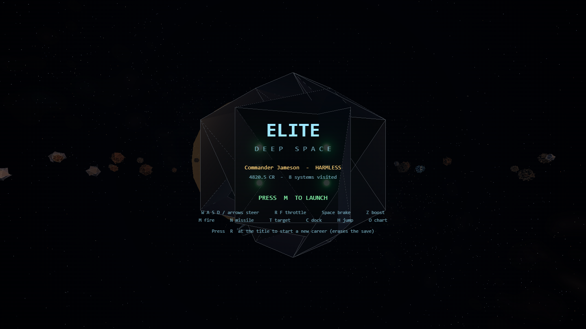
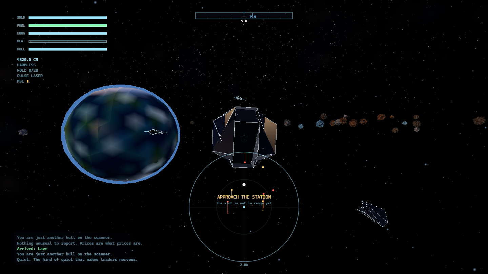
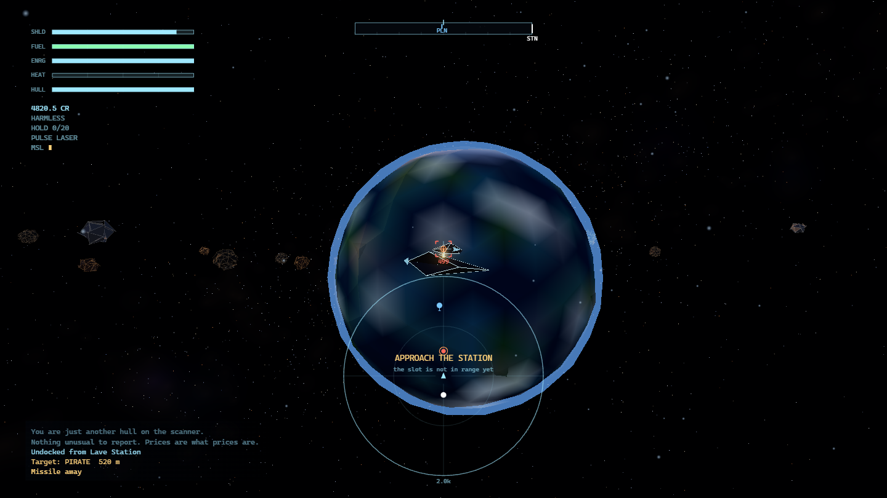
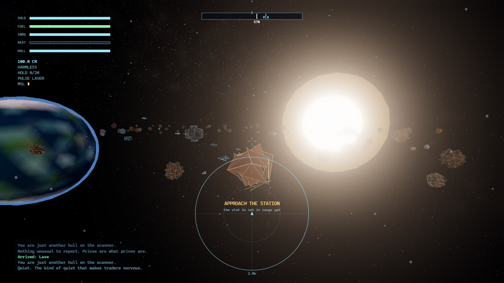
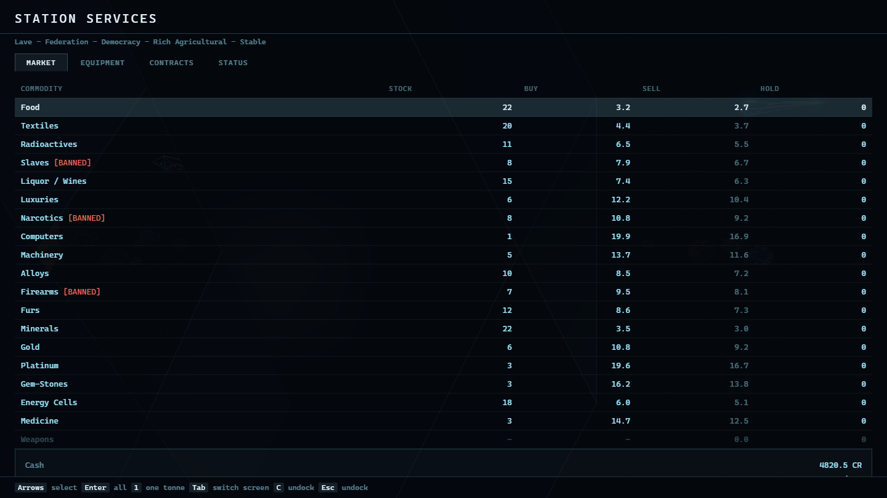
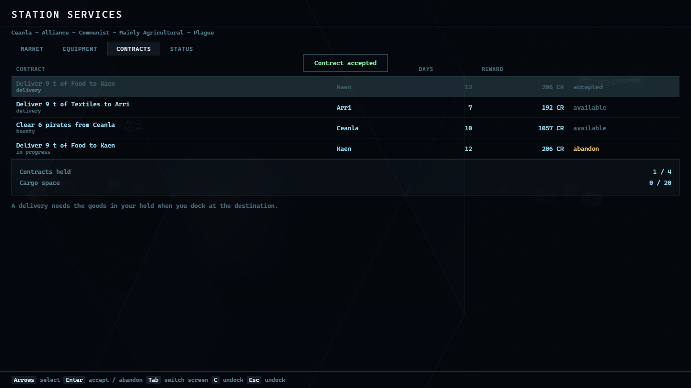
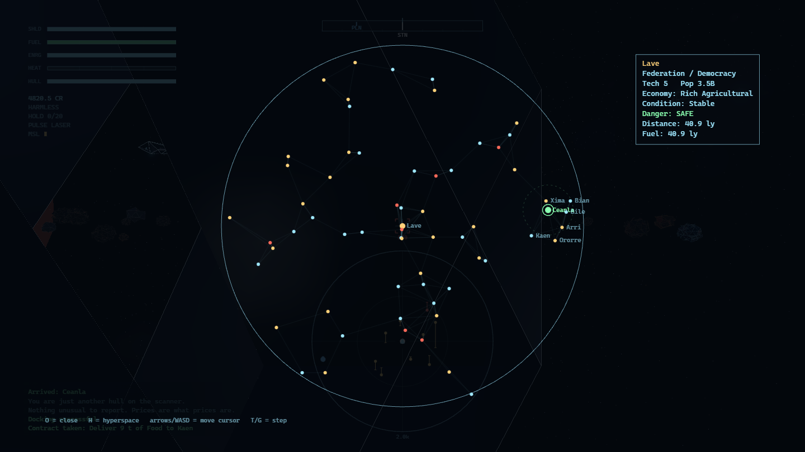

<p align="center"> <a href="https://threejs.org"></a> <a href="https://vitejs.dev"></a> <a href="package.json"></a> <a href="LICENSE"></a> <a href="https://alexanderkuzikov.github.io/Elite-Deep/"></a> </p>

<h1 align="center">ELITE: DEEP SPACE</h1>
<p align="center">Современная 3D-реинкарнация Elite (1984) — один самодостаточный HTML-файл, ноль ассетов</p>
<p align="center"><strong>v0.1.0</strong> · 694 юнита · 91 e2e · 708 kB (191 kB gzip)</p>

---

Галактика из 64 процедурно сгенерированных звёздных систем, связанных графом
прыжковых маршрутов. 19 товаров, 8 типов правительств и экономик, лестница
рейтинга от HARMLESS до ELITE, стыковка с вращающейся станцией Coriolis,
ведьминское пространство, топливозаборник, спасательная капсула.

Графика — компромисс между оригиналом и современностью. Космос больше не плоский
фон: процедурное небо строит 9000 звёзд вдоль галактической полосы, эмиссионные
туманности по спектральным линиям и пылевые полосы. Корпуса — физически корректные
материалы (`MeshStandardMaterial`) с металличностью и шероховатостью, отражающие
процедурную environment-пробу; силуэт несёт тонкая обводка (`EdgesGeometry`),
затухающая по дистанции. Сверху — bloom с ACES tone mapping.

- **Процедурная галактика** — MST-граф гарантирует связность, степень узла ≥ 2.
  Рёбер не фиксированное число: 103–221 в зависимости от сида (в среднем ~163 —
  MST даёт 63, остальное добавляет проход по тупикам).
- **Полёт** — кватернионный, по локальным осям, намеренно не-ньютоновский.
- **Бой** — импульсный и лучевой лазеры с перегревом, самонаводящиеся ракеты.
  Пираты атакуют проходами, разрывают бой при повреждениях, втягиваются в драку.
  Луч достаёт и породу в поясе: разбитый камень отдаёт руду канистрой.
- **Торговля и репутация** — динамические цены по экономике, правительству и
  условиям мира, контрабанда, штрафы. Репутация влияет на закупку и на патрули.
- **Контракты** — доска заданий: доставка, гуманитарный рейс, курьер, зачистка.
  Взятая зачистка **меняет саму систему**: она становится укреплённым гнездом.
- **Память мира** — расчищенные трассы безопаснее, убитые патрули опаснее.
- **Пояс и HUD** — четыре породы камня с разным числом граней, цветом и
  материалом; сканер, компас и проекция цели на Canvas 2D; процедурный WebAudio.

## Быстрый старт

Играть в браузере: **https://alexanderkuzikov.github.io/Elite-Deep/** — тот же
самодостаточный файл, что собирается локально.

```bash
npm install
npm run dev          # dev-сервер с горячей перезагрузкой
npm run build        # dist/index.html — один самодостаточный файл
npm test             # 694 юнита
npm run e2e          # 91 проверка в headless Chrome
npm run sim 200      # симулятор экономики: три карьеры на 200 прыжках
npm run check        # тесты + сборка + e2e
```

Нужен **Node 22+** и Google Chrome (только для e2e). Собранный `dist/index.html`
открывается двойным кликом по `file://` — без сервера и без сети.

**Управление:** `WASD`/стрелки — рули, `R`/`F` — тяга, `Space` — тормоз, `Z` —
форсаж, `M` — огонь, `N` — ракета, `T` — цель, `C` — стыковка, `H` — прыжок,
`O` — карта. Мышь — то же самое: клик захватывает указатель, и дальше корабль
слушается движения руки, `Esc` отпускает. На станции: `Enter` — взять контракт
или купить всё, `1` — одну тонну, `Tab` — переключить экран, `C` или `Esc` —
отстыковаться.

## Скриншоты

<p align="center">
  <br>
  <br>
  <br>
  <br>
  <br>
  <br>
  
</p>

## Документация

- [`docs/CONTEXT.md`](docs/CONTEXT.md) — состояние, журнал работ, открытые проблемы
- [`docs/DECISIONS.md`](docs/DECISIONS.md) — архитектурные решения (ADR) с замером
- [`AGENTS.md`](AGENTS.md) — конвенции и список грабель проекта

## Стек

| Слой | Технология |
|------|-----------|
| Рендер | Three.js r186, EffectComposer → UnrealBloomPass → OutputPass, ACES |
| Материалы | `MeshStandardMaterial` + процедурная equirect-проба |
| Небо | 9000 звёзд, галактический пояс, туманности, пыль |
| Сборка | Vite 8 + vite-plugin-singlefile |
| Логика | Чистый ESM, детерминированный PRNG (mulberry32, градиентный 3D-шум) |
| UI | Canvas 2D (HUD) + DOM (экраны станции); процедурный WebAudio |
| Тесты | `node:test` + puppeteer-core |

## Статус

**v0.1.0** — играбельно: полёт, бой, торговля, стыковка, прыжки, карта, рейтинг.
694 юнита и 91 e2e-проверка зелёные, CI и Pages работают. Собранный файл —
`dist/index.html`, 708 kB (191 kB gzip), открывается без сервера и без сети.

Открытые вопросы — дизайнерские, а не технические, перечислены в
[`docs/CONTEXT.md`](docs/CONTEXT.md).

## Лицензия

[MIT](LICENSE) © Alexander Kuzikov

«Elite» — товарный знак Дэвида Брэбена и Иэна Белла. Это некоммерческая фанатская
работа, не связанная с правообладателями: весь код написан с нуля, ни один ассет
оригинала не используется.
